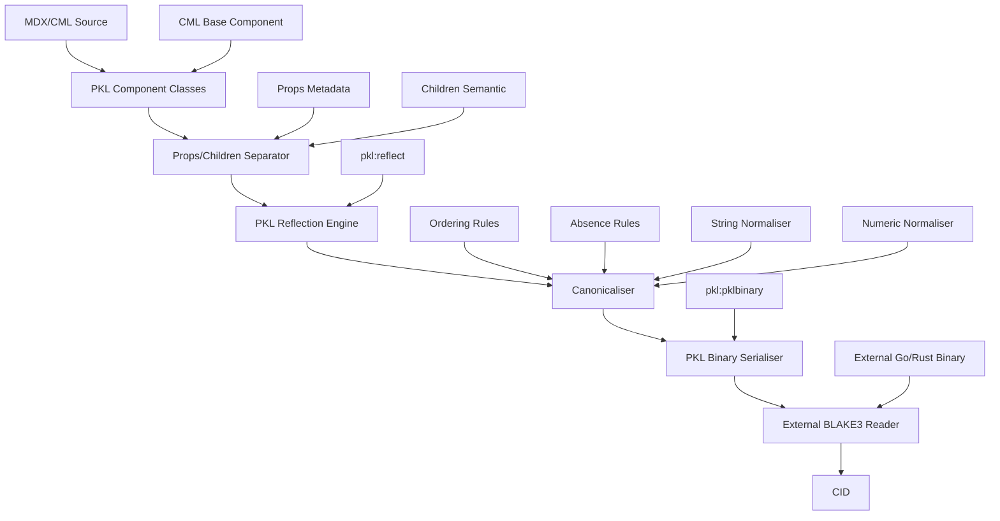
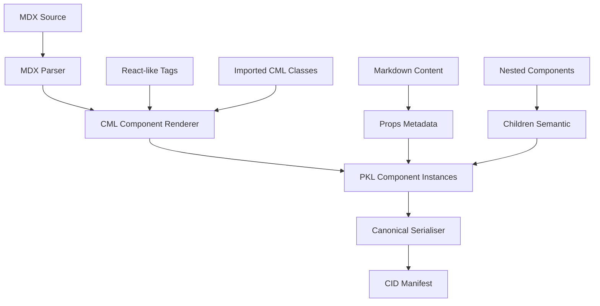
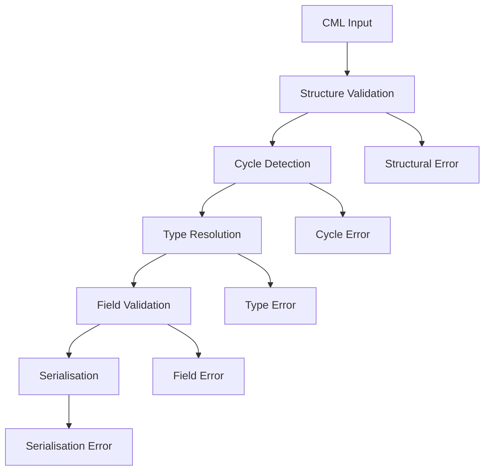

# CML Canonical Serialisation & CID Stability Design Document

## Overview

This document describes the design for a Component-Oriented Merkle-DAG canonical serialisation system for **CML (Computation Modeling Language)** — a closed, deterministic algebra for representing executable semantics as pure data. The system is implemented as importable PKL classes with strict separation between Props (metadata) and Children (semantic content), ensuring deterministic, stable Content Identifiers (CIDs) across implementations and platforms while supporting MDX authoring workflows.

The core innovation is treating CML as a tree of Importable Components where:
- **Props-Transparent Rule**: XML attributes (metadata/context) are NEVER hashed
- **Child-Identity Rule**: Semantic content (children) ALWAYS defines identity and is hashed
- **MDX Integration**: Components can be authored in MDX and rendered to CML Merkle-DAGs

**Component-Oriented Architecture Pipeline:**
```
MDX/CML Source → PKL Component Classes → Props/Children Separation → pkl:reflect → 
Canonicaliser → pkl:pklbinary → External BLAKE3 Reader → CID
```

## Architecture

### High-Level Architecture



### Component-Oriented Model

Every CML element is an instance of a PKL class that extends the base `CmlComponent`:

```pkl
abstract class CmlComponent {
  // Metadata/Context (Props): Ignored by Serialiser
  meta: Map<String, Any>?
  
  // Semantic Content (Children): Defines CID
  abstract children: List<CmlComponent>
  
  // Type identity for canonical serialization
  abstract nodeType: String
}
```

### Standard Library Components (M3 Core)

| Component Class | Role | Hashed Content (Children) | Non-Hashed (Props) |
|----------------|------|---------------------------|-------------------|
| `cml.Unit` | Logic Container | Signature, Block | author, version, doc |
| `cml.Call` | Execution | Target (CID), Arguments | timeout, retryPolicy |
| `cml.Literal` | Leaf Value | Primitive Value Node | ui:format, units |
| `cml.Var` | Reference | Name Node | color, alias |
| `cml.BinOp` | Binary Operation | Left, Right, Operator | precedence, associativity |

### Component Interaction Flow

1. **Component Definition Phase**: CML elements are defined as PKL classes extending `CmlComponent`
2. **Props/Children Separation Phase**: Metadata (props) is separated from semantic content (children)
3. **Introspection Phase**: PKL Reflection Engine examines semantic children only using pkl:reflect
4. **Canonicalization Phase**: Canonicaliser applies ordering, absence, and normalization rules to children
5. **Binary Serialisation Phase**: PKL Binary Serialiser produces deterministic MessagePack format
6. **Hashing Phase**: External BLAKE3 Reader generates final CID via external resource reader

### MDX Integration Pipeline



**MDX Example:**
```mdx
import { Unit, BinOp, Var, Literal } from '@cml/core'

# Discount Logic
This module calculates the final price after tax.

<Unit name="CalculateTotal" author="alice" doc="Tax calculation">
  <BinOp op="MULTIPLY">
    <Var name="price" />
    <Literal><float>1.15</float></Literal>
  </BinOp>
</Unit>
```

**Rendered to PKL:**
```pkl
new cml.Unit {
  // Props (not hashed)
  meta = Map("author", "alice", "doc", "Tax calculation")
  
  // Children (hashed)
  children = List(
    new cml.BinOp {
      children = List(
        new cml.Var { children = List(new cml.Name { value = "price" }) },
        new cml.Literal { children = List(new cml.Float { value = 1.15 }) }
      )
    }
  )
  nodeType = "cml.Unit"
}
```

### Merkle-DAG Construction

The system implements bottom-up Merkle tree construction where:
- Child nodes are processed before parents
- Each node's CID is computed from its canonical binary serialised form
- Parent nodes reference children by CID only
- Structural sharing is achieved through CID deduplication
- MessagePack format ensures deterministic byte sequences

## External BLAKE3 Reader Implementation

### Host Environment Requirements

Since PKL does not have built-in BLAKE3 support, the canonical serialisation system requires a host environment that provides BLAKE3 hashing via external resource reader.

### Implementation Approaches

#### Recommended: External Resource Reader
- Use `--external-resource-reader` flag with dedicated BLAKE3 binary
- Highest stability - decouples hashing from PKL versions
- Perfect for CI/CD and cross-platform deployment
- Context-free operation as required by M3 compliance

#### Alternative: Java/Kotlin Host Integration
- Use `org.apache.commons.codec.digest.Blake3` library in JVM applications
- Inject hashing function as PKL Mapping
- Best if CML is part of larger Java-based toolchain

### External Reader Protocol

**Resource URI Format**: `cid:<binary_content>`

**External Reader Binary**:
- Accepts binary content via stdin
- Computes BLAKE3 hash using standard parameters
- Returns hexadecimal CID via stdout
- Must be deterministic across platforms

**Example Implementation** (Go):
```go
package main

import (
    "encoding/hex"
    "io"
    "os"
    "github.com/zeebo/blake3"
)

func main() {
    content, _ := io.ReadAll(os.Stdin)
    hash := blake3.Sum256(content)
    os.Stdout.WriteString(hex.EncodeToString(hash[:]))
}
```

### Merkle Tree Construction with External Reader

```pkl
// Recursive CID computation for Merkle tree
function serialiseNode(node: CML_Node): String {
  local childrenCids = node.children.map((child) -> serialiseNode(child))
  local canonicalBinary = renderBinary(node, childrenCids)
  return computeCid(canonicalBinary)
}

function computeCid(content: ByteSequence): String =
  read("cid:\(content)")
```

## Components and Interfaces

### PKL Reflection Engine

**Purpose**: Introspect CML component instances to discover semantic children structure, excluding props metadata

**Interface**:
```pkl
abstract class ComponentReflectionEngine {
  function introspectComponent(instance: CmlComponent): ComponentStructure
  function getSemanticChildren(instance: CmlComponent): List<CmlComponent>
  function getNodeType(instance: CmlComponent): String
  function excludeProps(instance: CmlComponent): CmlComponent
}
```

**Key Responsibilities**:
- Use pkl:reflect.Class to examine CML component structure
- Extract only the `children` property, ignoring `meta` and other props
- Handle nested component structures through recursive traversal
- Provide type information via `nodeType` property for canonicalization
- Implement the Props-Transparent rule by filtering out metadata

**Props-Transparent Implementation:**
```pkl
function getSemanticChildren(node: CmlComponent): List<Any> =
  // Only include children field in canonical serialization
  node.children

function excludeProps(node: CmlComponent): Map<String, Any> =
  // Return only semantic fields for hashing
  Map("nodeType", node.nodeType, "children", node.children)
```

### MDX Component Renderer

**Purpose**: Transform MDX tags into PKL component instances with proper Props/Children separation

**Interface**:
```pkl
abstract class MDXComponentRenderer {
  function renderComponent(tagName: String, props: Map<String, Any>, children: List<Any>): CmlComponent
  function separatePropsAndChildren(element: MDXElement): ComponentData
  function createComponentInstance(componentClass: Class, data: ComponentData): CmlComponent
}
```

**Key Responsibilities**:
- Map MDX tag names to CML component classes
- Separate XML attributes into `meta` props (non-hashed)
- Transform nested elements into semantic `children` (hashed)
- Handle Markdown content as props metadata
- Ensure proper component class instantiation
- Maintain MDX authoring experience while enforcing M3 constraints

**MDX Transformation Example:**
```pkl
// MDX: <Unit name="add" author="alice">...</Unit>
// Becomes:
function renderUnit(props: Map<String, Any>, children: List<Any>): cml.Unit =
  new cml.Unit {
    meta = props.filter((key, _) -> key != "name")  // author goes to meta
    children = List(new cml.Name { value = props["name"] }) + children  // name becomes semantic child
    nodeType = "cml.Unit"
  }
```

### PKL Binary Serialiser

**Purpose**: Convert canonical CML structures to deterministic MessagePack binary format

**Interface**:
```pkl
abstract class PKLBinarySerialiser {
  function serialise(canonical: CanonicalNode): ByteSequence
  function serialiseWithPklBinary(instance: Any): ByteSequence
}
```

**Key Responsibilities**:
- Use pkl:pklbinary to generate deterministic MessagePack output
- Ensure consistent type codes for all CML node types
- Handle nested structures with proper slot ordering
- Leverage MessagePack's fixed array slot meanings for determinism
- Produce lossless binary representation of CML structures

### Component Canonicaliser

**Purpose**: Apply strict canonicalization rules to semantic children only, creating Normal Form

**Interface**:
```pkl
abstract class ComponentCanonicaliser {
  function canonicaliseComponent(component: CmlComponent): CanonicalComponent
  function orderChildren(children: List<CmlComponent>): List<CmlComponent>
  function normaliseStrings(text: String): String
  function normaliseNumbers(num: Number): String
  function applyChildIdentityRule(component: CmlComponent): CanonicalComponent
}
```

**Key Responsibilities**:
- Apply Child-Identity Rule: only semantic children contribute to CID
- Sort children by their canonical representation (deterministic ordering)
- Apply explicit absence markers (∅) for optional children
- Normalise strings to Unicode NFC in child values
- Convert numbers to IEEE 754 hexadecimal format in child values
- Ensure fully-qualified type names via `nodeType` property
- Exclude all props/metadata from canonicalization process

**Child-Identity Rule Implementation:**
```pkl
function applyChildIdentityRule(component: CmlComponent): CanonicalComponent =
  new CanonicalComponent {
    nodeType = component.nodeType
    semanticChildren = component.children.map((child) -> canonicaliseComponent(child))
    // meta field is completely ignored
  }
```

### Serialiser

**Purpose**: Convert canonical nodes to deterministic byte sequences (REPLACED by PKL Binary Serialiser)

### External BLAKE3 Reader

**Purpose**: Generate cryptographically secure CIDs from binary content via external process

**Interface**:
```pkl
abstract class ExternalBLAKE3Reader {
  function computeCid(content: ByteSequence): CID
  function readCidFromExternal(resourceUri: String): CID
}
```

**Key Responsibilities**:
- Interface with external BLAKE3 implementation via PKL's external resource reader
- Use --external-resource-reader flag to call Go/Rust binary
- Accept binary content and return BLAKE3 hash as CID
- Ensure platform-independent hashing through external tool
- Provide stable CID generation across different environments

**Implementation Strategy**:
```pkl
// CML Linker module
function computeCid(content: ByteSequence): String =
  read("cid:\(content)")
```

**External Reader Command**:
```bash
pkl eval --external-resource-reader cml-blake3-reader cml-serialiser.pkl
```

### Cycle Detector

**Purpose**: Prevent infinite loops during Merkle tree construction

**Interface**:
```pkl
abstract class CycleDetector {
  function detectCycles(root: CML_Node): Boolean
  function validateDAG(root: CML_Node): ValidationResult
}
```

**Key Responsibilities**:
- Traverse CML structures to detect circular references
- Maintain visited node tracking during traversal
- Reject structures containing cycles
- Provide descriptive error messages for cycle detection

## Data Models

### Core Data Structures

#### ComponentStructure
```pkl
class ComponentStructure {
  nodeType: String
  semanticChildren: List<CmlComponent>
  excludedProps: Map<String, Any>  // For debugging/tooling only
}
```

#### CanonicalComponent
```pkl
class CanonicalComponent {
  nodeType: String
  orderedChildren: List<CanonicalComponent>
  childCIDs: List<CID>  // Computed bottom-up
}
```

#### ComponentData
```pkl
class ComponentData {
  componentClass: Class
  props: Map<String, Any>  // Goes to meta (not hashed)
  children: List<CmlComponent>  // Goes to children (hashed)
}
```

#### MDXElement
```pkl
class MDXElement {
  tagName: String
  attributes: Map<String, Any>
  children: List<Any>  // Mix of text and nested elements
  markdownContent: String?
}
```

#### CanonicalNode
```pkl
class CanonicalNode {
  nodeType: String
  orderedChildren: List<CanonicalComponent>
  childCIDs: List<CID>
}
```

#### CanonicalField
```pkl
class CanonicalField {
  name: String
  value: CanonicalValue
  isAbsent: Boolean
}
```

#### CanonicalValue
```pkl
union CanonicalValue = 
  | PrimitiveValue
  | CollectionValue  
  | ReferenceValue
  | AbsenceMarker
```

### CML Component Mappings

#### Unit Component Mapping
```pkl
class cml.Unit extends CmlComponent {
  // Props (not hashed)
  meta: Map<String, Any>?  // author, version, doc, etc.
  
  // Children (hashed) - semantic content only
  children: List<CmlComponent>  // [NameNode, SignatureNode, BlockNode]
  nodeType = "cml.Unit"
}

// Canonical representation focuses only on children
class CanonicalUnit extends CanonicalComponent {
  nodeType = "cml.Unit"
  orderedChildren: List<CanonicalComponent>  // [CanonicalName, CanonicalSignature, CanonicalBlock]
}
```

#### Expression Component Mapping
```pkl
union CmlExpression extends CmlComponent =
  | cml.Literal
  | cml.Var
  | cml.Call
  | cml.BinOp
  | cml.Match

// Each expression type has semantic children only
class cml.BinOp extends CmlComponent {
  meta: Map<String, Any>?  // precedence, associativity (not hashed)
  children: List<CmlComponent>  // [LeftExpr, RightExpr, OperatorNode] (hashed)
  nodeType = "cml.BinOp"
}
```

#### Type Component Mapping
```pkl
union CmlType extends CmlComponent =
  | cml.PrimitiveType
  | cml.CompositeType
  | cml.FunctionType
  | cml.ArrayType
  | cml.ReferenceType

// Type references use CID-based identity
class cml.ReferenceType extends CmlComponent {
  meta: Map<String, Any>?  // ui hints, documentation
  children: List<CmlComponent>  // [CIDNode] - reference by CID only
  nodeType = "cml.ReferenceType"
}
```

## Correctness Properties

*A property is a characteristic or behavior that should hold true across all valid executions of a system—essentially, a formal statement about what the system should do. Properties serve as the bridge between human-readable specifications and machine-verifiable correctness guarantees.*

Before defining the correctness properties, I need to analyze the acceptance criteria from the requirements to determine which are testable as properties.

### Property 1: Props-Transparency
*For any* CML component, adding, removing, or modifying props (metadata in `meta` field) should NOT change the resulting CID
**Validates: Requirements 21.1 (Props-Transparent Rule)**

### Property 2: Child-Identity Determinism
*For any* CML component, the CID should be determined solely by the semantic children, with identical children producing identical CIDs
**Validates: Requirements 21.2 (Child-Identity Rule)**

### Property 3: Type-Identity Uniqueness
*For any* two components with identical children but different `nodeType` values, their CIDs should be different
**Validates: Requirements 21.3 (Type-Identity Rule)**

### Property 4: Serialisation Determinism
*For any* CML component, serializing it multiple times, in different environments, or at different times should always produce identical output
**Validates: Requirements 1.1, 1.2, 1.3, 10.1**

### Property 5: Uniqueness Guarantee  
*For any* two CML components with different semantic content (children), their canonical serialisations should be different
**Validates: Requirements 2.1**

### Property 6: Canonical Ordering
*For any* CML component with multiple children, the canonical serialisation should order children deterministically, regardless of input order
**Validates: Requirements 4.1, 4.2**

### Property 7: Explicit Absence Handling
*For any* CML component with optional children, absent children should serialise with explicit null marker (∅) and present children should serialise with their actual values
**Validates: Requirements 6.1, 6.2**

### Property 8: CID Reference Resolution
*For any* CML component with type references, the canonical serialisation should resolve all references to immutable CIDs rather than inline definitions
**Validates: Requirements 7.1**

### Property 9: Merkle Tree Structure
*For any* nested CML structure, children should be serialised before parents and parents should reference children by CID only
**Validates: Requirements 12.1, 12.2**

### Property 10: MDX Rendering Consistency
*For any* MDX source that renders to CML components, the resulting CIDs should be identical to manually constructed equivalent components
**Validates: Requirements 22.1 (MDX Authoring Layer)**

## Error Handling

### Error Categories

#### Structural Errors
- **Circular Reference Error**: Detected when CML structure contains cycles
- **Invalid Node Type Error**: Encountered when reflection discovers unknown node types
- **Missing Field Error**: Required fields are absent from CML nodes

#### Serialisation Errors  
- **Unicode Normalization Error**: String cannot be normalised to NFC
- **Numeric Format Error**: Number cannot be converted to IEEE 754 hex format
- **Type Resolution Error**: Referenced type cannot be resolved to CID

#### Integration Errors
- **PKL Reflection Error**: PKL reflection API fails or returns unexpected data
- **BLAKE3 Hash Error**: External BLAKE3 hasher fails or is unavailable
- **XML Rendering Error**: PKL XML renderer produces invalid output

### Error Handling Strategy

#### Fail-Fast Approach
The system employs a fail-fast strategy where any error during the serialisation pipeline immediately terminates processing and returns a descriptive error. This ensures:
- No partial or corrupted serialisations are produced
- CID stability is maintained (no CIDs for invalid structures)
- Clear error messages help developers identify issues

#### Error Recovery
No automatic error recovery is attempted as this could compromise determinism. Instead:
- Detailed error messages indicate the specific failure point
- Error context includes the CML node path where failure occurred
- Suggested fixes are provided where applicable

#### Validation Pipeline


## Implementation Plan

### Phase 1: Core Component Architecture

#### 1.1 Base Component System
- Define `CmlComponent` abstract base class with `meta` and `children` separation
- Implement component type registry for `nodeType` validation
- Create standard library components (`cml.Unit`, `cml.BinOp`, `cml.Literal`, etc.)
- Establish Props-Transparent and Child-Identity rules in type system

#### 1.2 PKL Reflection Integration
- Implement `ComponentReflectionEngine` using `pkl:reflect`
- Create semantic children extraction logic (ignore `meta` field)
- Build recursive component traversal for nested structures
- Add component type introspection via `nodeType` property

### Phase 2: Canonicalization Engine

#### 2.1 Component Canonicaliser
- Implement `ComponentCanonicaliser` with Child-Identity rule enforcement
- Create deterministic child ordering algorithm
- Add explicit absence handling for optional children
- Implement string normalization (Unicode NFC) and numeric formatting (IEEE 754 hex)

#### 2.2 Merkle-DAG Construction
- Build bottom-up CID calculation for child components
- Implement CID-based parent-child referencing
- Add cycle detection for component graphs
- Create structural sharing through CID deduplication

### Phase 3: Serialization Pipeline

#### 3.1 PKL Binary Serialiser Integration
- Configure `pkl:pklbinary` for deterministic MessagePack output
- Implement canonical component serialization to binary format
- Add consistent type encoding for all CML component types
- Ensure platform-independent binary representation

#### 3.2 External BLAKE3 Integration
- Create external resource reader protocol for BLAKE3 hashing
- Implement Go/Rust BLAKE3 binary for CID generation
- Add PKL integration via `--external-resource-reader` flag
- Ensure deterministic hashing across platforms

### Phase 4: MDX Authoring Layer

#### 4.1 MDX Component Renderer
- Implement MDX tag to PKL component mapping
- Create props/children separation logic for MDX elements
- Add Markdown content handling as props metadata
- Build component class instantiation from MDX tags

#### 4.2 MDX Pipeline Integration
- Integrate with MDX parser (Unified/Remark)
- Create CML-specific MDX renderer (alternative to React renderer)
- Implement MDX → PKL component transformation
- Add CID manifest generation from MDX sources

### Phase 5: Testing and Validation

#### 5.1 Property-Based Testing
- Implement all 10 correctness properties as property-based tests
- Create component generators for comprehensive test coverage
- Add cross-platform consistency validation
- Build determinism verification across multiple runs

#### 5.2 Integration Testing
- Test end-to-end MDX → CML → CID pipeline
- Validate PKL reflection with real component structures
- Test external BLAKE3 integration across platforms
- Add performance benchmarking for large component trees

### Phase 6: Tooling and Documentation

#### 6.1 Development Tools
- Create CML component inspector for debugging
- Build CID stability validator for component changes
- Add MDX preview with CID display
- Implement component diff visualization

#### 6.2 Documentation and Examples
- Write comprehensive component authoring guide
- Create MDX integration examples
- Document Props-Transparent and Child-Identity patterns
- Provide migration guide from traditional XML-based CML

## Implementation Strategy

### Technology Stack
- **Core Language**: PKL for component definitions and reflection
- **Binary Serialization**: `pkl:pklbinary` (MessagePack format)
- **Hashing**: External BLAKE3 binary (Go/Rust implementation)
- **MDX Integration**: Unified/Remark parser with custom CML renderer
- **Testing**: Property-based testing framework (language-specific)

### Key Design Decisions

#### Props vs Children Separation
```pkl
// CORRECT: Semantic data as children (hashed)
new cml.Unit {
  meta = Map("author", "alice", "doc", "Adds numbers")  // Not hashed
  children = List(
    new cml.Name { value = "add" },  // Hashed
    new cml.Signature { ... },       // Hashed
    new cml.Block { ... }            // Hashed
  )
}

// INCORRECT: Semantic data as props (would break CID stability)
new cml.Unit {
  name = "add"  // Would be hashed, breaking Props-Transparent rule
  meta = Map("author", "alice")
  children = List(...)
}
```

#### MDX Component Mapping
```mdx
<!-- MDX Source -->
<Unit name="add" author="alice" doc="Adds two numbers">
  <Signature>
    <Param name="a" type="Int" />
    <Param name="b" type="Int" />
  </Signature>
  <Block>
    <Return>
      <BinOp op="+">
        <Var name="a" />
        <Var name="b" />
      </BinOp>
    </Return>
  </Block>
</Unit>
```

```pkl
// Rendered PKL Component
new cml.Unit {
  meta = Map("author", "alice", "doc", "Adds two numbers")  // Props → meta
  children = List(
    new cml.Name { value = "add" },  // name attribute → semantic child
    new cml.Signature { ... },       // Nested elements → children
    new cml.Block { ... }
  )
  nodeType = "cml.Unit"
}
```

### Critical Implementation Notes

1. **CID Stability**: Any change to the canonicalization algorithm breaks all existing CIDs
2. **Props-Transparent Rule**: Metadata must NEVER influence CID calculation
3. **Child-Identity Rule**: All semantic content must be modeled as children
4. **External Dependencies**: BLAKE3 integration must be deterministic across platforms
5. **MDX Compatibility**: Component rendering must preserve semantic equivalence

This implementation plan ensures that the CML canonical serialization system maintains M3 compliance while providing an excellent authoring experience through MDX integration.

### Dual Testing Approach

The testing strategy employs both unit tests and property-based tests as complementary approaches:

**Unit Tests** focus on:
- Specific examples of each CML node type
- Edge cases like empty collections, null values, special characters
- Integration points between components
- Error conditions and exception handling
- XML rendering format validation

**Property-Based Tests** focus on:
- Universal properties that hold across all valid inputs
- Comprehensive input coverage through randomization
- Cross-platform consistency validation
- Determinism verification across multiple runs

### Property-Based Testing Configuration

**Testing Framework**: Use QuickCheck-style property testing library for the target language
**Minimum Iterations**: 100 iterations per property test to ensure statistical confidence
**Test Tagging**: Each property test must reference its design document property

Tag format: **Feature: cml-canonical-serialisation, Property {number}: {property_text}**

### Property Test Implementation

Each correctness property must be implemented as a single property-based test:

#### Property 1 Test
```
Feature: cml-canonical-serialisation, Property 1: Serialisation Determinism
Generate random CML nodes, serialise multiple times, verify identical output
```

#### Property 2 Test  
```
Feature: cml-canonical-serialisation, Property 2: Uniqueness Guarantee
Generate pairs of different CML nodes, verify different serialisations
```

#### Property 3 Test
```
Feature: cml-canonical-serialisation, Property 3: Canonical Ordering
Generate CML nodes with unordered fields/maps, verify canonical ordering
```

#### Property 4 Test
```
Feature: cml-canonical-serialisation, Property 4: Explicit Absence Handling
Generate CML nodes with optional fields, verify absence markers and present values
```

#### Property 5 Test
```
Feature: cml-canonical-serialisation, Property 5: CID Reference Resolution
Generate CML nodes with type references, verify CID resolution not inlining
```

#### Property 6 Test
```
Feature: cml-canonical-serialisation, Property 6: Merkle Tree Structure
Generate nested CML structures, verify child-before-parent and CID referencing
```

#### Property 7 Test
```
Feature: cml-canonical-serialisation, Property 7: Numeric Format Consistency
Generate floating point numbers, verify IEEE 754 hex format
```

#### Property 8 Test
```
Feature: cml-canonical-serialisation, Property 8: String Normalization
Generate strings with different Unicode representations, verify NFC normalization
```

#### Property 9 Test
```
Feature: cml-canonical-serialisation, Property 9: Cycle Detection
Generate CML structures with cycles, verify detection and rejection
```

### Unit Test Coverage

Unit tests should cover:
- Each CML node type (Unit, Block, Expression, Loop, Call, Match, Type, Constraint)
- Boundary conditions (empty collections, maximum nesting depth)
- Special values (NaN, Infinity, empty strings, Unicode edge cases)
- Error conditions (malformed input, missing dependencies)
- XML output format validation
- BLAKE3 integration testing

### Integration Testing

Integration tests verify:
- End-to-end serialisation pipeline from CML input to CID output
- PKL reflection integration with real CML structures
- pkl.experimental.syntax package integration
- BLAKE3 external tool integration
- Cross-platform consistency (if multiple platforms supported)

### Performance Testing

While not part of correctness, performance tests should verify:
- Serialisation time scales reasonably with input size
- Memory usage remains bounded during large structure processing
- BLAKE3 hashing performance meets requirements

The testing strategy ensures comprehensive validation of both specific behaviors (unit tests) and universal properties (property tests), providing confidence in the system's correctness and reliability.

## Testing Strategy

### Dual Testing Approach

The testing strategy employs both unit tests and property-based tests as complementary approaches:

**Unit Tests** focus on:
- Specific examples of each CML component type
- Edge cases like empty collections, null values, special characters
- Integration points between components
- Error conditions and exception handling
- MDX rendering format validation
- Props vs Children separation validation

**Property-Based Tests** focus on:
- Universal properties that hold across all valid inputs
- Comprehensive input coverage through randomization
- Cross-platform consistency validation
- Determinism verification across multiple runs
- Props-transparency and Child-identity rule validation

### Property-Based Testing Configuration

**Testing Framework**: Use QuickCheck-style property testing library for the target language
**Minimum Iterations**: 100 iterations per property test to ensure statistical confidence
**Test Tagging**: Each property test must reference its design document property

Tag format: **Feature: cml-canonical-serialisation, Property {number}: {property_text}**

### Property Test Implementation

Each correctness property must be implemented as a single property-based test:

#### Property 1 Test
```
Feature: cml-canonical-serialisation, Property 1: Props-Transparency
Generate CML components with varying props, verify identical CIDs for same children
```

#### Property 2 Test  
```
Feature: cml-canonical-serialisation, Property 2: Child-Identity Determinism
Generate CML components with identical children, verify identical CIDs
```

#### Property 3 Test
```
Feature: cml-canonical-serialisation, Property 3: Type-Identity Uniqueness
Generate components with same children but different nodeType, verify different CIDs
```

#### Property 4 Test
```
Feature: cml-canonical-serialisation, Property 4: Serialisation Determinism
Generate CML components, serialise multiple times, verify identical output
```

#### Property 5 Test
```
Feature: cml-canonical-serialisation, Property 5: Uniqueness Guarantee
Generate pairs of different CML components, verify different serialisations
```

#### Property 6 Test
```
Feature: cml-canonical-serialisation, Property 6: Canonical Ordering
Generate CML components with unordered children, verify canonical ordering
```

#### Property 7 Test
```
Feature: cml-canonical-serialisation, Property 7: Explicit Absence Handling
Generate CML components with optional children, verify absence markers
```

#### Property 8 Test
```
Feature: cml-canonical-serialisation, Property 8: CID Reference Resolution
Generate CML components with type references, verify CID resolution not inlining
```

#### Property 9 Test
```
Feature: cml-canonical-serialisation, Property 9: Merkle Tree Structure
Generate nested CML structures, verify child-before-parent and CID referencing
```

#### Property 10 Test
```
Feature: cml-canonical-serialisation, Property 10: MDX Rendering Consistency
Generate MDX sources, verify CIDs match manually constructed components
```

### Unit Test Coverage

Unit tests should cover:
- Each CML component type (Unit, Block, Expression, Loop, Call, Match, Type, Constraint)
- Props vs Children separation for all component types
- MDX tag mapping to PKL components
- Boundary conditions (empty collections, maximum nesting depth)
- Special values (NaN, Infinity, empty strings, Unicode edge cases)
- Error conditions (malformed input, missing dependencies, circular references)
- External BLAKE3 integration testing

### Integration Testing

Integration tests verify:
- End-to-end MDX → CML → CID pipeline
- PKL reflection integration with real CML component structures
- External BLAKE3 tool integration across platforms
- Cross-platform consistency (if multiple platforms supported)
- Component class loading and instantiation

### Performance Testing

While not part of correctness, performance tests should verify:
- Serialisation time scales reasonably with component tree size
- Memory usage remains bounded during large structure processing
- BLAKE3 hashing performance meets requirements
- MDX rendering performance for large documents

The testing strategy ensures comprehensive validation of both specific behaviors (unit tests) and universal properties (property tests), providing confidence in the system's correctness and reliability while maintaining the Props-Transparent and Child-Identity architectural principles.