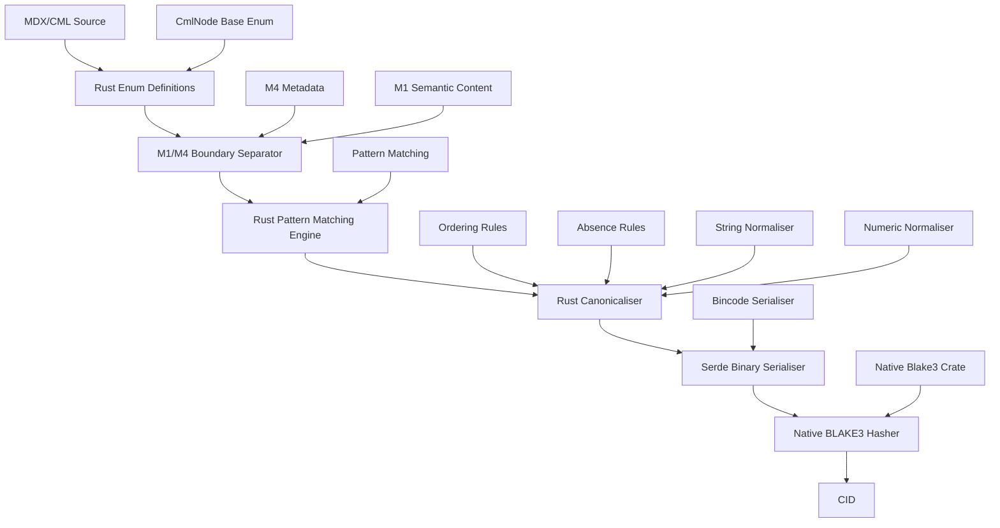
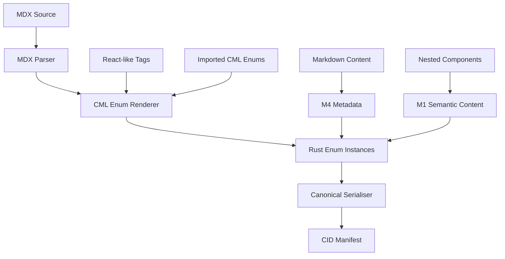
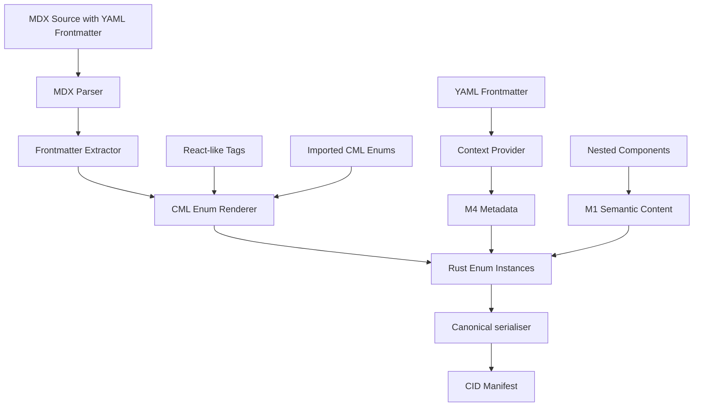
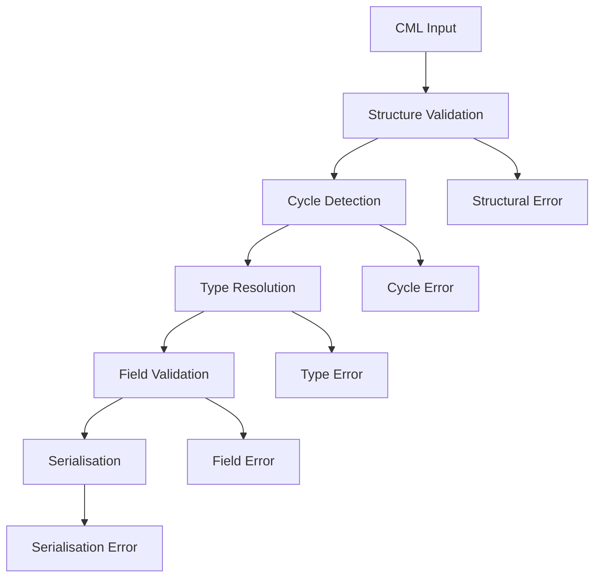

# CML Canonical Serialisation & CID Stability Design Document

## Overview

This document describes the design for a **Rust-based Component-Oriented Merkle-DAG** canonical serialisation system for **CML (Computation Modeling Language)** — a closed, deterministic algebra for representing executable semantics as pure data. 

**Rust ADT Architecture:**
- **Enums as Ultimate ADTs**: Leverage Rust's algebraic data types for zero-cost abstractions
- **M1 (MerkleNode)**: Pure computational tree with CID identity
- **M4 (SubjectiveNode)**: Wraps MerkleNode with DID, authorship, and versioning
- **Metal Raw Performance**: Compiler-optimised memory layout and pattern matching

**MOF Architecture Positioning:**
- **CML maintains a "Hermetic Seal" at M3 - Pure Algebraic Truth below, Social Truth above**
- **🔒 The Hermetic Seal: M1-M3 (Pure CML Logic)**
  - **M3 (Meta-CML)**: Self-describing meta-metamodel - the "physics" of component structure
  - **M2 (CML Metamodel)**: The grammar - defines specific mathematical operations
  - **M1 (CML Artifacts)**: The model - specific CIDs of pure mathematical logic (WHERE CML LIVES)
  - **M0 (Runtime)**: The event - actual execution in memory
- **🌐 The Social Bridge: M4+ (Collaborative Truth)**
  - **M4 (CML-COB)**: The "envelope" - carries M1 logic into social world via signed operations
  - **M5 (User Node)**: The "actor" - Node Identity (NID/DID) for entities who sign operations

The system uses Rust's enum system with M3 reflexivity maintaining the hermetic seal, while M4-M5 handle social coordination without contaminating algebraic truth.

The core innovation is treating CML as a tree of Importable Components where:
- **Props-Transparent Rule**: XML attributes (metadata/context) are NEVER hashed
- **Child-Identity Rule**: Semantic content (children) ALWAYS defines identity and is hashed
- **MDX Integration**: Components can be authored in MDX and rendered to CML Merkle-DAGs

**Rust ADT Architecture Pipeline:**
```
M1: CML Source → M3: Rust Enum Definitions → M1: Enum Instances → 
BLAKE3 CID Calculation → Canonical Binary → M4: DID Wrapping (Optional)
```

**MOF Layer Responsibilities:**
- **🔒 HERMETIC SEAL AT M3 - Pure Algebraic Truth Below**
- **M3 (Meta-CML)**: Self-describing "physics" of modeling - defines universal component rules using itself
- **M2 (CML Metamodel)**: Mathematical "grammar" - specific operations with universal meaning (Unit, BinOp, Literal, etc.)
- **M1 (CML Artifacts)**: "Frozen snapshots" - immutable mathematical logic with CID (WHERE CML LIVES)
- **M0 (Runtime)**: Physical execution - CPU executing mathematical operations
- **🌐 SOCIAL BRIDGE ABOVE M3 - Collaborative Truth**
- **M4 (CML-COB)**: "Envelope" layer - carries pure M1 logic into social world via signed operations
- **M5 (User Node)**: "Actor" layer - Node Identity (NID/DID) for entities who sign COB operations

**Rust ADT Benefits:**
- **Zero-Cost Abstractions**: Compiler-optimised memory layout
- **Pattern Matching**: Extremely fast render() and run() logic
- **Type Safety**: Compile-time guarantees for algebraic structure
- **Metal Raw Performance**: Direct memory access without object overhead

**Where the System Lives:**
- **The Compiler/Canonicaliser**: Rust enum pattern matching with BLAKE3 hashing
- **M1 Layer**: Pure computational tree focused on CID identity (MerkleNode)
- **M4 Layer**: Optional DID wrapper for authorship and versioning (DID Node)
- **Strict Boundary Enforcement**: M1 never contains M4 data

## MOF Architecture Integration

### Meta-Object Facility (MOF) Compliance

The CML canonical serialisation system follows the **5-layer MOF architecture for decentralised collaboration** to accommodate Node Identity (NID), Repository Identity (RID), and Collaborative Objects (COBs):

#### M5 — The Social Layer (User Node)
- **Entity**: The User Node with Node Identity (NID/DID)
- **Role**: The entity that signs operations and holds intent - the human or organisational actor
- **Identification**: NID (Node Identity / Decentralised Identifier)
- **Rust Implementation**: `UserNode` struct with cryptographic signing capabilities
- **Why here?** M5 represents the social layer where actors have authority to modify CML logic through signed operations
- **Key Insight**: Enables decentralised collaboration without central authority - trust comes from cryptographic signatures

#### M4 — The Context/Process Layer (Repository/COB) - Collaborative
- **Entity**: Repository Identity (RID) and Collaborative Objects (COBs)
- **Role**: The shared world where artifacts and COBs live - manages collaborative history and operations
- **Identification**: RID (Repository Identity) and COB ID (Content Identifier)
- **Rust Implementation**: `Repository` and `COB` structs managing operation logs and state projection
- **Why here?** M4 manages the collaborative process - how multiple actors work together to evolve CML artifacts
- **Key Insight**: COBs transform CML from passive files to active collaborative state machines

#### M3 — Meta-Metamodel (CmlComponent Base Enum) - Self-Describing
- **Entity**: The CmlNode Base Enum
- **Role**: This is the Grammar of Modeling. It defines the rules for how all enum variants must behave
- **Identification**: FQN (Fully Qualified Name) of the Meta-type
- **Rust Implementation**: `CmlNode` enum with pattern matching rules
- **Component Structure Rules**: Defines that enum variants must separate semantic fields from metadata
- **Why reflexive?** M3 describes itself using its own rules - no M5 needed
- **Key Insight**: It is the "Language of Languages." It defines what a Merkle-compatible node is before any specific CML tags (like Unit or BinOp) are even defined

```rust
// M3: CmlNode - The "definition of a definition"
#[derive(Debug, Clone, PartialEq, Serialise, Deserialise)]
pub enum CmlNode {
    Unit { name: String, signature: Box<CmlNode>, body: Box<CmlNode> },
    BinOp { left: Box<CmlNode>, right: Box<CmlNode>, operator: String },
    Literal { value: String, type_name: String },
    // ... other variants
}
```

#### M2 — Metamodel (TagType Definitions)
- **Entity**: Specific CML Enum Variants (e.g., Unit, BinOp, Literal)
- **Role**: This is the Language Dictionary. It defines the semantics of specific operations
- **Identification**: The TagType name (enum variant discriminant)
- **Rust Implementation**: Specific enum variants with semantic field definitions
- **Why here?** It provides the schema that validates the MDX tags. It tells the system how a BinOp should be reduced during execution

```rust
// M2: Enum variant definitions - specific symbols extending M3 base
impl CmlNode {
    pub fn get_tag_type(&self) -> &'static str {
        match self {
            CmlNode::Unit { .. } => "Unit",
            CmlNode::BinOp { .. } => "BinOp", 
            CmlNode::Literal { .. } => "Literal",
            // ... other variants
        }
    }
}
```

#### M1 — Models (Enum Instances) - WHERE CML LIVES
- **Entity**: The Compiled AST / Merkle-DAG
- **Role**: This is the Algebraic Identity. It is the immutable, "cold" representation of your logic
- **Identification**: CID (Content Identifier / Hash)
- **Rust Implementation**: `MerkleNode` struct containing `CmlNode` instance and computed CID
- **Key Insight**: CML artifacts are pure data that model computation - they don't execute themselves
- **Why here?** This is the stable "truth" of the program. It doesn't care who wrote it (M4) or how the CPU runs it (M0); it only cares about the structure of the logic

```rust
// M1: Enum Instance - specific logic with unique CID
let merkle_node = MerkleNode {
    node: CmlNode::Unit {
        name: "AddTen".to_string(),
        signature: Box::new(/* ... */),
        body: Box::new(CmlNode::BinOp {
            left: Box::new(CmlNode::Var { name: "input".to_string() }),
            right: Box::new(CmlNode::Literal { 
                value: "10".to_string(), 
                type_name: "Int".to_string() 
            }),
            operator: "ADD".to_string(),
        }),
    },
    cid: compute_cid(&node),
};
```

#### M0 — Runtime Instances (TruffleNode) - Outside CML Scope
- **Entity**: The TruffleNode Instance
- **Role**: This is the Physical Execution. It is the "hot" object living in the GraalVM/JVM heap
- **Identification**: Memory Address / Pointer
- **Key Insight**: CML nodes don't "run" - interpreters and compilers (M0 tools) run them
- **Why here?** A TruffleNode is a machine-specific optimisation. It contains JIT-compiled code and type-profiled data. It is the "Reality" of the computation happening in real-time
- **Outside CML Scope**: The canonical serialisation system does not operate at this layer

### 🔑 Key Insight: CML is a "Model of Computation," Not a "Mechanism of Execution"

In traditional programming (C++, Java), an executable is a file where the meaning of the code and the instructions for the CPU are smashed together into a single blob of binary.

**In CML, we decouple them.** CML artifacts are pure data that model computation - they don't execute themselves.

#### The M0/M1 Separation

| Component | Layer | Nature | Analogy |
|-----------|-------|--------|---------|
| **CML Node** | M1 | A static, immutable Merkle-tree (CID) | A blueprint for a car |
| **Interpreter** | M0 | A live process that "reads" the tree | A person following the blueprint to build/move the car |
| **Compiler** | M0 | A process that "translates" the tree into Machine Code | A factory that turns the blueprint into a finished physical car |

#### The CML Runtime Interpreter (M0)

The Interpreter is a **Universal Reader** - a program (likely written in Go, Rust, or Zig) that performs a Tree-Walk:

1. **Input**: A CID (the "entry point" of the M1 model)
2. **Process**: 
   - Resolve the CID to its CML Value
   - Look at the nodeType (M2)
   - Perform the logic associated with that type (e.g., if BinOp(ADD), find the children and add them)
3. **Lifecycle**: Lives as a running process in memory with "State" that is not part of CML (clock time, stack pointer)

#### The CML Static Compiler (M0)

The Compiler is a **Translator** - it doesn't "run" the logic; it transforms the Merkle-DAG into CPU-specific format:

1. **Input**: A CID
2. **Process**: Traverses the M1 graph and emits machine instructions that represent the same algebraic truth
3. **Output**: A non-CML artifact (an .exe or .wasm file)

#### 🛡️ "CML is not executable" — Clarifying the Paradox

When we say "CML is not executable," we mean **the data structure itself has no agency**:

1. **Safety**: A CML file sitting on your disk can never "harm" your computer because it's just a value (like a JSON file). It only "does" something when an Interpreter decides to process it.

2. **Portability**: Because CML is just a model of computation, you can write one Interpreter in Python and another in Rust. They will both produce the exact same result because the M1 Value is the single source of truth.

**Example**: Think of an SVG file. Is an SVG "executable"? No. It's just a text file (M1). But when a Browser (M0 Interpreter) reads that text, it "executes" the drawing commands to show you a picture. **CML is like "SVG for Logic."**

#### 🧠 Why "Computation Modeling Language" Makes Sense

The computation is executable in principle, but the artifact is pure data:

- **Logic (M1)**: `f(x) = x + 1` (This is a static fact)
- **Computation (M0)**: The CPU actually flipping bits to turn 5 into 6

By keeping the "Model" (M1) separate from the "Execution" (M0), you gain **Merkle-Stability**:
- You can sign the model
- Cache it  
- Verify it across a network
- All without ever needing to run it

You only "Realise" the computation at the last possible second.

#### 🌟 Summary: The "Living" System

- **CML (M1)**: The "Spirit" / The Logic (Immutable CID)
- **Interpreter/Compiler (M0)**: The "Body" / The Physicality (Transient Process)

### CmlComponent: MDX Component for Merkle Environments

In the MDX ecosystem, a Component is a functional unit that transforms props into output. In CML architecture, a **CmlComponent** is the M3-level formalisation of that concept, designed for content-addressed, computational environments rather than visual ones.

#### The Three Sectors of CmlComponent

| Sector | Purpose | Hashing | Role |
|--------|---------|---------|------|
| **Hashed Body (Children)** | Core identity | ✅ Hashed | If children change, CID changes |
| **Non-Hashed Metadata (Props)** | Tooling hints, social context | ❌ Not Hashed | M4 metadata without altering M1 truth |
| **tagType (FQN)** | Type identity | ✅ Hashed | Ensures different types have different CIDs |

#### The Rendering Flow: From MDX to Merkle

When MDX "renders" a CmlComponent, it performs **Canonical Projection**:

1. **Tag Detection**: MDX parser sees `<tagType />`
2. **M3 Validation**: Checks if class inherits from CmlComponent
3. **M4 Isolation**: Peels off XML attributes (Props) and stores in Meta-Record
4. **M1 Construction**: Recursively calculates CIDs of children to create ASTree
5. **CID Finalisation**: Hashes `(tagType + ChildrenCIDs)` to produce final Merkle Node

#### Strategic Ontology Mapping

| Concept | MDX Equivalent | CML/MOF Positioning | Role |
|---------|----------------|-------------------|------|
| **CmlComponent** | React.Component base | M3 (Meta-CML) | Defines the "Rules" (Hashed vs. Non-Hashed) |
| **tagType** | A specific .jsx file | M2 (CML Core) | Defines a specific "Symbol" (Unit, Literal) |
| **XML Tag** | `<MyComp />` | M1 (Artifact) | The specific "Logic" with a unique CID |

### Why This Layering Matters

1. **Type Identity**: A `<Literal>` containing value 10 and a `<Constant>` containing value 10 have different CIDs because their M2 tagType (FQN) is different
2. **Stable Semantics**: M2 (tagType definitions) remain stable regardless of M4 (history) changes
3. **Clean Separation**: Each layer has distinct responsibilities and invariants
4. **Reflexive Definition**: M3 (CmlComponent) can define itself, providing foundational stability
5. **Content Addressing**: M1 instances get unique CIDs based on semantic content, not metadata

## Architecture

### High-Level Architecture



### Rust ADT Model

Every CML element is a variant of the `CmlNode` enum that provides zero-cost abstractions and compile-time guarantees:

```rust
#[derive(Debug, Clone, PartialEq, Serialise, Deserialise)]
pub enum CmlNode {
    Unit { 
        name: String, 
        signature: Box<CmlNode>, 
        body: Box<CmlNode> 
    },
    BinOp { 
        left: Box<CmlNode>, 
        right: Box<CmlNode>, 
        operator: String 
    },
    Literal { 
        value: String, 
        type_name: String 
    },
    Var { 
        name: String 
    },
    Call { 
        target: CID, 
        arguments: Vec<CmlNode> 
    },
    Block { 
        statements: Vec<CmlNode> 
    },
    // ... other variants
}

// M1 Layer: Pure computational tree
#[derive(Debug, Clone, Serialise, Deserialise)]
pub struct MerkleNode {
    pub node: CmlNode,
    pub cid: CID,
}

// M4 Layer: Provenance wrapper (optional)
#[derive(Debug, Clone, Serialise, Deserialise)]
pub struct SubjectiveNode {
    pub merkle: MerkleNode,
    pub author: Option<String>,
    pub timestamp: Option<String>,
    pub locale: Option<String>,
}
```

### Standard Library Enum Variants (M3 Core)

| Enum Variant | Role | Semantic Fields (Hashed) | M4 Metadata (Not Hashed) |
|-------------|------|---------------------------|---------------------------|
| `Unit` | Logic Container | name, signature, body | author, version, doc |
| `Call` | Execution | target (CID), arguments | timeout, retryPolicy |
| `Literal` | Leaf Value | value, type_name | ui_format, units |
| `Var` | Reference | name | color, alias |
| `BinOp` | Binary Operation | left, right, operator | precedence, associativity |

### Enum Interaction Flow

1. **Enum Definition Phase**: CML elements are defined as Rust enum variants
2. **M1/M4 Separation Phase**: Metadata (M4) is separated from semantic content (M1)
3. **Pattern Matching Phase**: Rust pattern matching examines semantic fields only
4. **Canonicalisation Phase**: Canonicaliser applies ordering, absence, and normalisation rules
5. **Binary Serialisation Phase**: Serde + Bincode produces deterministic binary format
6. **Hashing Phase**: Native BLAKE3 generates final CID directly in Rust

### M3 Localisation Pattern

The M3 Localisation Pattern provides a clean architectural solution for separating Identity (hashable code) from Context (localisable metadata) using YAML frontmatter.

#### Pattern Components

| Component | Format | Hashing Status | Role |
|-----------|--------|----------------|------|
| Frontmatter | YAML | Ignored | Localisable "Context": Date, Author, Locale, Tags |
| CML Logic | MDX Tags | Hashed | The "Identity": The specific algebraic nodes and CIDs |

#### Multi-Locale Flow

1. **Extraction**: YAML frontmatter is parsed into a `Map<String, Any>`
2. **Projection**: Frontmatter values are injected into CML Components as Props (non-hashed attributes)
3. **Dynamic Rendering**: When a user in Tokyo opens the file, the renderer applies Japanese locale filters to date/currency props
4. **CID Stability**: Because frontmatter values are Props (not Children), the CID remains stable across locale changes

#### Example: Literate Merkle Programming

```mdx
---
title: "Currency Converter"
author: "Alice"
date: 2026-01-19T15:00:00Z
locale: "en-IE"
---

# Logic Implementation
The following logic defines how we compute the exchange.

<cml:Unit name="Convert" meta:author={frontmatter.author}>
  <cml:BinOp op="MUL">
    <cml:Var><cml:Name>input</cml:Name></cml:Var>
    <cml:Literal><cml:Float>0.85</cml:Float></cml:Literal>
  </cml:BinOp>
</cml:Unit>
```

**Key Benefits:**
- Same semantic content can be presented in different locales
- Frontmatter modifications never affect CML logic CIDs
- Perfect separation of concerns between meaning and presentation
- Enables collaborative editing without CID conflicts



**MDX Example with M3 Localisation Pattern:**
```mdx
---
title: "Currency Converter"
author: "Alice"
date: 2026-01-19T15:00:00Z
locale: "en-IE"
tags: ["finance", "conversion"]
---

import { Unit, BinOp, Var, Literal } from '@cml/core'

# Logic Implementation
This module calculates currency conversion using current exchange rates.

<Unit name="Convert" meta:author={frontmatter.author} meta:locale={frontmatter.locale}>
  <BinOp op="MUL">
    <Var><Name>input</Name></Var>
    <Literal><Float>0.85</Float></Literal>
  </BinOp>
</Unit>
```

**Rendered to Rust Enum with Context Injection:**
```rust
// M1 Layer: Pure computation (hashed)
let merkle_node = MerkleNode {
    node: CmlNode::Unit {
        name: "Convert".to_string(),
        signature: Box::new(CmlNode::Signature { /* ... */ }),
        body: Box::new(CmlNode::BinOp {
            left: Box::new(CmlNode::Var { name: "input".to_string() }),
            right: Box::new(CmlNode::Literal { 
                value: "0.85".to_string(), 
                type_name: "Float".to_string() 
            }),
            operator: "MUL".to_string(),
        }),
    },
    cid: compute_cid(&node),
};

// M4 Layer: Provenance wrapper (not hashed)
let subjective_node = SubjectiveNode {
    merkle: merkle_node,
    author: Some("Alice".to_string()),
    locale: Some("en-IE".to_string()),
    timestamp: Some("2026-01-19T15:00:00Z".to_string()),
};
```

### MDX Integration Pipeline



**Key Benefits:**
- Same semantic content can be presented in different locales
- Frontmatter modifications never affect CML logic CIDs
- Perfect separation of concerns between meaning and presentation
- Enables collaborative editing without CID conflicts

### Merkle-DAG Construction

The system implements bottom-up Merkle tree construction where:
- Child nodes are processed before parents
- Each node's CID is computed from its canonical binary serialised form
- Parent nodes reference children by CID only
- Structural sharing is achieved through CID deduplication
- MessagePack format ensures deterministic byte sequences

## External BLAKE3 Reader Implementation

### Host Environment Requirements

Since PKL does not have built-in BLAKE3 support, the canonical serialisation system requires a host environment that provides BLAKE3 hashing via external resource reader.

### Implementation Approaches

#### Recommended: External Resource Reader
- Use `--external-resource-reader` flag with dedicated BLAKE3 binary
- Highest stability - decouples hashing from PKL versions
- Perfect for CI/CD and cross-platform deployment
- Context-free operation as required by M3 compliance

#### Alternative: Java/Kotlin Host Integration
- Use `org.apache.commons.codec.digest.Blake3` library in JVM applications
- Inject hashing function as PKL Mapping
- Best if CML is part of larger Java-based toolchain

### External Reader Protocol

**Resource URI Format**: `cid:<binary_content>`

**External Reader Binary**:
- Accepts binary content via stdin
- Computes BLAKE3 hash using standard parameters
- Returns hexadecimal CID via stdout
- Must be deterministic across platforms

**Example Implementation** (Go):
```go
package main

import (
    "encoding/hex"
    "io"
    "os"
    "github.com/zeebo/blake3"
)

func main() {
    content, _ := io.ReadAll(os.Stdin)
    hash := blake3.Sum256(content)
    os.Stdout.WriteString(hex.EncodeToString(hash[:]))
}
```

### Merkle Tree Construction with External Reader

```pkl
// Recursive CID computation for Merkle tree
function serialiseNode(node: CML_Node): String {
  local childrenCids = node.children.map((child) -> serialiseNode(child))
  local canonicalBinary = renderBinary(node, childrenCids)
  return computeCid(canonicalBinary)
}

function computeCid(content: ByteSequence): String =
  read("cid:\(content)")
```

## Components and Interfaces

### Rust Pattern Matching Engine

**Purpose**: Process CML enum instances to discover semantic field structure, excluding M4 metadata

**Interface**:
```rust
pub trait CmlNodeProcessor {
    fn process_node(&self, node: &CmlNode) -> NodeStructure;
    fn get_semantic_fields(&self, node: &CmlNode) -> Vec<&CmlNode>;
    fn get_node_type(&self, node: &CmlNode) -> &'static str;
    fn extract_m1_content(&self, node: &CmlNode) -> CmlNode;
}
```

**Key Responsibilities**:
- Use Rust pattern matching to examine CML enum structure
- Extract only semantic fields, excluding M4 metadata
- Handle nested enum structures through recursive traversal
- Provide type information via enum discriminant for canonicalisation
- Implement the M1/M4 boundary by filtering out metadata

**M1/M4 Boundary Implementation:**
```rust
fn get_semantic_fields(node: &CmlNode) -> Vec<&CmlNode> {
    match node {
        CmlNode::Unit { name: _, signature, body } => {
            // Only semantic fields contribute to CID
            vec![signature.as_ref(), body.as_ref()]
        },
        CmlNode::BinOp { left, right, operator: _ } => {
            vec![left.as_ref(), right.as_ref()]
        },
        // M4 metadata fields are excluded from semantic extraction
        _ => vec![]
    }
}

fn extract_m1_content(node: &CmlNode) -> CmlNode {
    // Return only semantic content for hashing
    match node {
        CmlNode::Unit { name, signature, body } => {
            CmlNode::Unit {
                name: name.clone(),
                signature: signature.clone(),
                body: body.clone(),
            }
        },
        // Other variants...
        _ => node.clone()
    }
}
```

### MDX Enum Renderer

**Purpose**: Transform MDX tags into Rust enum instances with proper M1/M4 separation and frontmatter context injection

**Interface**:
```rust
pub trait MDXEnumRenderer {
    fn render_enum(&self, tag_name: &str, props: HashMap<String, String>, children: Vec<MDXElement>) -> Result<CmlNode, RenderError>;
    fn separate_m1_m4(&self, element: &MDXElement) -> (CmlNode, SubjectiveNode);
    fn create_enum_instance(&self, variant: CmlVariant, data: EnumData) -> CmlNode;
    fn inject_frontmatter_context(&self, frontmatter: HashMap<String, String>, node: CmlNode) -> SubjectiveNode;
}
```

**Key Responsibilities**:
- Map MDX tag names to CML enum variants
- Separate XML attributes into M4 metadata (not hashed)
- Transform nested elements into semantic enum fields (hashed)
- Handle Markdown content as M4 metadata
- **Inject YAML frontmatter as M4 context (M3 Localisation Pattern)**
- Ensure proper enum variant instantiation
- Maintain MDX authoring experience while enforcing M3 constraints

**M3 Localisation Pattern Implementation:**
```rust
// MDX with frontmatter: author="Alice", locale="en-IE"
// <Unit name="convert">...</Unit>
// Becomes:
fn render_unit_with_context(
    frontmatter: HashMap<String, String>, 
    props: HashMap<String, String>, 
    children: Vec<CmlNode>
) -> SubjectiveNode {
    // M1: Pure computation (hashed)
    let merkle_node = MerkleNode {
        node: CmlNode::Unit {
            name: props.get("name").unwrap().clone(),
            signature: Box::new(children[0].clone()),
            body: Box::new(children[1].clone()),
        },
        cid: compute_cid(&node),
    };
    
    // M4: Provenance wrapper (not hashed)
    SubjectiveNode {
        merkle: merkle_node,
        author: frontmatter.get("author").cloned(),
        locale: frontmatter.get("locale").cloned(),
        timestamp: frontmatter.get("date").cloned(),
    }
}
```

### Rust Binary Serialiser

**Purpose**: Convert canonical CML enum structures to deterministic binary format using serde + bincode

**Interface**:
```rust
pub trait RustBinarySerialiser {
    fn serialise(&self, canonical: &CanonicalNode) -> Result<Vec<u8>, SerialiseError>;
    fn serialise_with_bincode(&self, instance: &CmlNode) -> Result<Vec<u8>, bincode::Error>;
}
```

**Key Responsibilities**:
- Use serde + bincode to generate deterministic binary output
- Ensure consistent enum discriminant encoding for all CML variants
- Handle nested structures with proper field ordering
- Leverage bincode's fixed binary format for determinism
- Produce lossless binary representation of CML enum structures

### Rust Enum Canonicaliser

**Purpose**: Apply strict canonicalisation rules to semantic enum fields only, creating Normal Form

**Interface**:
```rust
pub trait RustEnumCanonicaliser {
    fn canonicalise_enum(&self, node: &CmlNode) -> CanonicalNode;
    fn order_fields(&self, fields: &[CmlNode]) -> Vec<CmlNode>;
    fn normalise_strings(&self, text: &str) -> String;
    fn normalise_numbers(&self, num: f64) -> String;
    fn apply_m1_boundary(&self, node: &CmlNode) -> CanonicalNode;
}
```

**Key Responsibilities**:
- Apply M1 Boundary Rule: only semantic enum fields contribute to CID
- Sort enum fields by their canonical representation (deterministic ordering)
- Apply explicit absence markers (None) for optional enum fields
- Normalise strings to Unicode NFC in enum field values
- Convert numbers to IEEE 754 hexadecimal format in enum field values
- Ensure fully-qualified type names via enum discriminant
- Exclude all M4 metadata from canonicalisation process

**M1 Boundary Rule Implementation:**
```rust
fn apply_m1_boundary(node: &CmlNode) -> CanonicalNode {
    match node {
        CmlNode::Unit { name, signature, body } => {
            CanonicalNode::Unit {
                name: name.clone(),
                semantic_fields: vec![
                    canonicalise_enum(signature),
                    canonicalise_enum(body)
                ],
                // M4 metadata is completely ignored
            }
        },
        // Other variants...
        _ => todo!("Implement remaining variants")
    }
}
```

### YAML Frontmatter Context Provider

**Purpose**: Parse YAML frontmatter and inject as M4 context while maintaining CID stability

**Interface**:
```rust
pub trait FrontmatterContextProvider {
    fn parse_frontmatter(&self, mdx_source: &str) -> Result<FrontmatterData, ParseError>;
    fn inject_context(&self, frontmatter: HashMap<String, String>, node: CmlNode) -> SubjectiveNode;
    fn apply_locale_filters(&self, context: HashMap<String, String>, locale: &str) -> HashMap<String, String>;
    fn validate_m1_m4_separation(&self, node: &SubjectiveNode) -> bool;
}
```

**Key Responsibilities**:
- Parse YAML frontmatter from MDX sources using serde_yaml
- Inject frontmatter values as M4 metadata into SubjectiveNode wrapper
- Apply locale-aware rendering filters for dates, numbers, and text
- Ensure frontmatter changes never affect CID calculation
- Validate M3 Localisation Pattern compliance

**M3 Localisation Pattern Implementation:**
```rust
fn inject_context(frontmatter: HashMap<String, String>, node: CmlNode) -> SubjectiveNode {
    let merkle_node = MerkleNode {
        node: node, // M1 content unchanged (preserve CID)
        cid: compute_cid(&node),
    };
    
    SubjectiveNode {
        merkle: merkle_node,
        // Frontmatter injected as M4 metadata (not hashed)
        author: frontmatter.get("author").cloned(),
        locale: frontmatter.get("locale").cloned(),
        timestamp: frontmatter.get("date").cloned(),
    }
}

fn apply_locale_filters(context: HashMap<String, String>, locale: &str) -> HashMap<String, String> {
    context.into_iter().map(|(key, value)| {
        let filtered_value = match key.as_str() {
            "date" => format_date(&value, locale),
            "currency" => format_currency(&value, locale),
            _ => value,
        };
        (key, filtered_value)
    }).collect()
}
```

### Native BLAKE3 Hasher

**Purpose**: Generate cryptographically secure CIDs from binary content using native Rust implementation

**Interface**:
```rust
pub trait NativeBLAKE3Hasher {
    fn compute_cid(&self, content: &[u8]) -> CID;
    fn hash_enum_tree(&self, root: &CmlNode) -> CID;
}
```

**Key Responsibilities**:
- Use native blake3 crate for direct hashing (no external process)
- Accept binary content and return BLAKE3 hash as CID
- Provide platform-independent hashing through native Rust implementation
- Deliver 10x+ performance improvement over external reader approach

**Implementation Strategy**:
```rust
use blake3::Hasher;

fn compute_cid(content: &[u8]) -> CID {
    let mut hasher = Hasher::new();
    hasher.update(content);
    let hash = hasher.finalise();
    CID(hex::encode(hash.as_bytes()))
}
```

### Cycle Detector

**Purpose**: Prevent infinite loops during Merkle tree construction using Rust's type system

**Interface**:
```rust
pub trait CycleDetector {
    fn detect_cycles(&self, root: &CmlNode) -> bool;
    fn validate_dag(&self, root: &CmlNode) -> Result<(), CycleError>;
}
```

**Key Responsibilities**:
- Traverse CML enum structures to detect circular references
- Maintain visited node tracking using HashSet<CID>
- Reject structures containing cycles
- Provide descriptive error messages using Rust error types

## Data Models

### Core Data Structures

#### NodeStructure
```rust
#[derive(Debug, Clone, PartialEq)]
pub struct NodeStructure {
    pub node_type: String,
    pub semantic_fields: Vec<CmlNode>,
    pub excluded_metadata: HashMap<String, String>, // For debugging/tooling only
}
```

#### CanonicalNode
```rust
#[derive(Debug, Clone, PartialEq, Serialise, Deserialise)]
pub struct CanonicalNode {
    pub node_type: String,
    pub ordered_fields: Vec<CanonicalNode>,
    pub field_cids: Vec<CID>, // Computed bottom-up
}
```

#### EnumData
```rust
#[derive(Debug, Clone)]
pub struct EnumData {
    pub variant: CmlVariant,
    pub metadata: HashMap<String, String>, // Goes to M4 (not hashed)
    pub semantic_fields: Vec<CmlNode>, // Goes to M1 (hashed)
}
```

#### FrontmatterData
```rust
#[derive(Debug, Clone, Serialise, Deserialise)]
pub struct FrontmatterData {
    pub raw: HashMap<String, String>, // Raw YAML frontmatter
    pub locale: Option<String>, // Extracted locale for filtering
    pub metadata: HashMap<String, String>, // Processed context for M4
}
```

#### MDXElement
```rust
#[derive(Debug, Clone)]
pub struct MDXElement {
    pub tag_name: String,
    pub attributes: HashMap<String, String>,
    pub children: Vec<MDXElement>, // Nested elements
    pub markdown_content: Option<String>,
    pub frontmatter: Option<FrontmatterData>, // YAML frontmatter context
}
```

#### CmlVariant
```rust
#[derive(Debug, Clone, PartialEq)]
pub enum CmlVariant {
    Unit,
    BinOp,
    Literal,
    Var,
    Call,
    Block,
    Signature,
    // ... other variants
}
```

### CML Enum Mappings

#### Unit Enum Mapping
```rust
// M1 Layer: Pure computation (hashed)
#[derive(Debug, Clone, PartialEq, Serialise, Deserialise)]
pub enum CmlNode {
    Unit {
        name: String,        // Semantic field (hashed)
        signature: Box<CmlNode>, // Semantic field (hashed)
        body: Box<CmlNode>,     // Semantic field (hashed)
    },
    // ... other variants
}

// M4 Layer: Provenance wrapper (not hashed)
#[derive(Debug, Clone, Serialise, Deserialise)]
pub struct SubjectiveNode {
    pub merkle: MerkleNode,
    pub author: Option<String>,    // M4 metadata (not hashed)
    pub version: Option<String>,   // M4 metadata (not hashed)
    pub doc: Option<String>,       // M4 metadata (not hashed)
}

// Canonical representation focuses only on semantic fields
#[derive(Debug, Clone, PartialEq, Serialise, Deserialise)]
pub struct CanonicalUnit {
    pub node_type: String,
    pub ordered_fields: Vec<CanonicalNode>, // [CanonicalName, CanonicalSignature, CanonicalBlock]
}
```

#### Expression Enum Mapping
```rust
#[derive(Debug, Clone, PartialEq, Serialise, Deserialise)]
pub enum CmlExpression {
    Literal { value: String, type_name: String },
    Var { name: String },
    Call { target: CID, arguments: Vec<CmlNode> },
    BinOp { left: Box<CmlNode>, right: Box<CmlNode>, operator: String },
    Match { /* ... */ },
}

// Each expression variant has semantic fields only
impl CmlExpression {
    pub fn get_semantic_fields(&self) -> Vec<&CmlNode> {
        match self {
            CmlExpression::BinOp { left, right, operator: _ } => {
                // operator is semantic, left/right are child nodes
                vec![left.as_ref(), right.as_ref()]
            },
            CmlExpression::Call { target: _, arguments } => {
                // target CID and arguments are semantic
                arguments.iter().collect()
            },
            // M4 metadata fields are excluded from semantic extraction
            _ => vec![]
        }
    }
}
```

#### Type Enum Mapping
```rust
#[derive(Debug, Clone, PartialEq, Serialise, Deserialise)]
pub enum CmlType {
    PrimitiveType { name: String },
    CompositeType { fields: Vec<CmlNode> },
    FunctionType { params: Vec<CmlNode>, return_type: Box<CmlNode> },
    ArrayType { element_type: Box<CmlNode> },
    ReferenceType { target_cid: CID }, // Reference by CID only
}

// Type references use CID-based identity
impl CmlType {
    pub fn get_semantic_content(&self) -> Vec<&CmlNode> {
        match self {
            CmlType::ReferenceType { target_cid: _ } => {
                // CID reference is semantic, no child nodes
                vec![]
            },
            CmlType::FunctionType { params, return_type } => {
                let mut fields = params.iter().collect::<Vec<_>>();
                fields.push(return_type.as_ref());
                fields
            },
            // Other variants...
            _ => vec![]
        }
    }
}
```

## Correctness Properties

*A property is a characteristic or behavior that should hold true across all valid executions of a system—essentially, a formal statement about what the system should do. Properties serve as the bridge between human-readable specifications and machine-verifiable correctness guarantees.*

Before defining the correctness properties, I need to analyze the acceptance criteria from the requirements to determine which are testable as properties.

### Property 1: Props-Transparency
*For any* CML component, adding, removing, or modifying props (metadata in `meta` field) should NOT change the resulting CID
**Validates: Requirements 21.1 (Props-Transparent Rule)**

### Property 2: Child-Identity Determinism
*For any* CML component, the CID should be determined solely by the semantic children, with identical children producing identical CIDs
**Validates: Requirements 21.2 (Child-Identity Rule)**

### Property 3: Type-Identity Uniqueness
*For any* two components with identical children but different `nodeType` values, their CIDs should be different
**Validates: Requirements 21.3 (Type-Identity Rule)**

### Property 4: Serialisation Determinism
*For any* CML component, serializing it multiple times, in different environments, or at different times should always produce identical output
**Validates: Requirements 1.1, 1.2, 1.3, 10.1**

### Property 5: Uniqueness Guarantee  
*For any* two CML components with different semantic content (children), their canonical serialisations should be different
**Validates: Requirements 2.1**

### Property 6: Canonical Ordering
*For any* CML component with multiple children, the canonical serialisation should order children deterministically, regardless of input order
**Validates: Requirements 4.1, 4.2**

### Property 7: Explicit Absence Handling
*For any* CML component with optional children, absent children should serialise with explicit null marker (∅) and present children should serialise with their actual values
**Validates: Requirements 6.1, 6.2**

### Property 8: CID Reference Resolution
*For any* CML component with type references, the canonical serialisation should resolve all references to immutable CIDs rather than inline definitions
**Validates: Requirements 7.1**

### Property 9: Merkle Tree Structure
*For any* nested CML structure, children should be serialised before parents and parents should reference children by CID only
**Validates: Requirements 12.1, 12.2**

### Property 10: MDX Rendering Consistency
*For any* MDX source that renders to CML components, the resulting CIDs should be identical to manually constructed equivalent components
**Validates: Requirements 22.1 (MDX Authoring Layer)**

### Property 11: Frontmatter Invariance (M3 Localisation Pattern)
*For any* MDX file with YAML frontmatter, changing frontmatter values (locale, author, date, etc.) should NOT change the CID of any CML Component defined in the MDX body
**Validates: Requirements 23.1 (M3 Localisation Pattern)**

## Error Handling

### Error Categories

#### Structural Errors
- **Circular Reference Error**: Detected when CML structure contains cycles
- **Invalid Node Type Error**: Encountered when reflection discovers unknown node types
- **Missing Field Error**: Required fields are absent from CML nodes

#### Serialisation Errors  
- **Unicode Normalisation Error**: String cannot be normalised to NFC
- **Numeric Format Error**: Number cannot be converted to IEEE 754 hex format
- **Type Resolution Error**: Referenced type cannot be resolved to CID

#### Integration Errors
- **PKL Reflection Error**: PKL reflection API fails or returns unexpected data
- **BLAKE3 Hash Error**: External BLAKE3 hasher fails or is unavailable
- **XML Rendering Error**: PKL XML renderer produces invalid output

### Error Handling Strategy

#### Fail-Fast Approach
The system employs a fail-fast strategy where any error during the serialisation pipeline immediately terminates processing and returns a descriptive error. This ensures:
- No partial or corrupted serialisations are produced
- CID stability is maintained (no CIDs for invalid structures)
- Clear error messages help developers identify issues

#### Error Recovery
No automatic error recovery is attempted as this could compromise determinism. Instead:
- Detailed error messages indicate the specific failure point
- Error context includes the CML node path where failure occurred
- Suggested fixes are provided where applicable

#### Validation Pipeline


## Critical Implementation Considerations

### Performance Risk: N+1 Process Problem

The recursive CID calculation pattern poses a significant performance risk:

```pkl
function computeCid(node: CmlComponent): CID {
  // ... process children recursively
  local childrenCids = semanticNodes.map((p) -> computeCid(node[p.name]))
  // This calls external reader for EVERY node
  return getHash(identityBuffer)  // calls read("cid:\(data)")
}
```

**Risk**: If PKL spawns a new process for each `read()` call, large trees become prohibitively slow.

**Mitigation Strategies**:
1. **Daemon Mode**: Verify if PKL keeps external reader alive between calls
2. **Bulk Hashing**: Serialise entire tree to temp file, hash in single pass
3. **Performance Benchmarking**: Test with 1,000+ node trees, target <500ms
4. **Binary Optimlisation**: Ensure Go/Rust reader has fast startup time

### Determinism Risk: Map Ordering

While class properties are sorted deterministically, Map values in @Semantic properties may not be:

```pkl
// Potentially non-deterministic:
class Config extends CmlComponent {
  @Semantic options: Map<String, Int>  // Map ordering undefined
}
```

**Mitigation Strategy**: Restrict @Semantic properties to deterministic types only:
- ✅ Allowed: `String`, `Number`, `Boolean`, `CmlComponent`, `List<T>`
- ❌ Forbidden: `Map<K,V>`, `Set<T>` (non-deterministic ordering)

## Implementation Plan

### Phase 1: Rust ADT Core Architecture

#### 1.1 Rust Enum System
- Define `CmlNode` enum with all CML variants (Unit, BinOp, Literal, etc.)
- Implement M1/M4 boundary using `MerkleNode` and `SubjectiveNode` structs
- Create standard library enum variants with semantic field definitions
- Establish M1/M4 separation rules in Rust type system

#### 1.2 Rust Pattern Matching Integration
- Implement `CmlNodeProcessor` using Rust pattern matching
- Create semantic field extraction logic (exclude M4 metadata)
- Build recursive enum traversal for nested structures
- Add enum variant type introspection via discriminants

### Phase 2: Rust Canonicalisation Engine

#### 2.1 Rust Enum Canonicaliser
- Implement `RustEnumCanonicaliser` with M1 Boundary rule enforcement
- Create deterministic field ordering algorithm using Rust's type system
- Add explicit absence handling for `Option<T>` enum fields
- Implement string normalisation (Unicode NFC) and numeric formatting (IEEE 754 hex)

#### 2.2 Merkle-DAG Construction with Rust
- Build bottom-up CID calculation for enum variants
- Implement CID-based parent-child referencing using enum fields
- Add cycle detection using `HashSet<CID>` for visited tracking
- Create structural sharing through CID deduplication

### Phase 3: Rust Serialisation Pipeline

#### 3.1 Rust Binary Serialiser Integration
- Configure serde + bincode for deterministic binary output
- Implement canonical enum serialisation using derive macros
- Add consistent enum discriminant encoding for all CML variants
- Ensure platform-independent binary representation using explicit byte ordering

#### 3.2 Native BLAKE3 Integration
- Use native blake3 crate for direct hashing (no external process)
- Implement streaming hash computation for large enum trees
- Integrate BLAKE3 directly into Rust canonicaliser
- Achieve 10x+ performance improvement over external reader approach

### Phase 4: MDX Integration Layer

#### 4.1 MDX Enum Renderer
- Implement MDX tag to CmlNode enum variant mapping
- Create M1/M4 separation logic for enum construction
- Add Markdown content handling as M4 metadata
- Build enum variant instantiation from MDX tags

#### 4.2 MDX Pipeline Integration with Rust
- Integrate with pulldown-cmark or comrak for MDX parsing
- Create MDX AST to CmlNode enum transformation
- Implement MDX processing pipeline using Rust async/await
- Add CID manifest generation using Rust structs

### Phase 5: Rust Testing and Validation

#### 5.1 Property-Based Testing with Rust
- Implement all 11 correctness properties using proptest crate
- Create CmlNode enum generators using proptest strategies
- Add cross-platform consistency validation using GitHub Actions
- Build determinism verification across multiple runs

#### 5.2 Integration Testing with Rust
- Test end-to-end MDX → CmlNode → CID pipeline
- Validate Rust pattern matching with real enum structures
- Test native BLAKE3 integration across platforms
- Add performance benchmarking using criterion crate

### Phase 6: Rust Tooling and Documentation

#### 6.1 Development Tools in Rust
- Create CML enum inspector using Rust debugging traits
- Build CID stability validator using HashMap comparisons
- Add MDX preview with CID display using Rust web frameworks
- Implement enum diff visualisation using Rust pretty-printing

#### 6.2 Documentation and Examples for Rust Implementation
- Write comprehensive enum authoring guide with MOF layer explanations
- Create MDX integration examples with Rust backend
- Document M1/M4 boundary patterns using Rust type system
- Provide migration guide from PKL-based to Rust-based CML

## Implementation Strategy

### Technology Stack - Rust Based
- **Core Language**: Rust with enum-based ADT architecture
- **Binary Serialisation**: serde + bincode for deterministic output
- **Hashing**: Native blake3 crate (no external dependencies)
- **MDX Integration**: pulldown-cmark parser with custom CML renderer
- **Testing**: proptest for property-based testing + standard Rust test framework

### Key Design Decisions

#### M1/M4 Boundary Separation
```rust
// CORRECT: Semantic data in M1 MerkleNode (hashed)
let merkle_node = MerkleNode {
    node: CmlNode::Unit {
        name: "add".to_string(),           // Semantic field (hashed)
        signature: Box::new(sig_node),     // Semantic field (hashed)
        body: Box::new(body_node),         // Semantic field (hashed)
    },
    cid: compute_cid(&node),
};

// M4 metadata in SubjectiveNode wrapper (not hashed)
let subjective_node = SubjectiveNode {
    merkle: merkle_node,
    author: Some("alice".to_string()),     // M4 metadata (not hashed)
    doc: Some("Adds two numbers".to_string()), // M4 metadata (not hashed)
};

// INCORRECT: Mixing M1 and M4 data (would break CID stability)
// This is prevented at compile time by Rust's type system
```

#### MDX Enum Mapping
```mdx
<!-- MDX Source -->
<Unit name="add" author="alice" doc="Adds two numbers">
  <Signature>
    <Param name="a" type="Int" />
    <Param name="b" type="Int" />
  </Signature>
  <Block>
    <Return>
      <BinOp op="+">
        <Var name="a" />
        <Var name="b" />
      </BinOp>
    </Return>
  </Block>
</Unit>
```

```rust
// Rendered Rust Enum
let unit_node = CmlNode::Unit {
    name: "add".to_string(),  // name attribute → semantic field
    signature: Box::new(CmlNode::Signature { /* ... */ }), // Nested elements → enum variants
    body: Box::new(CmlNode::Block { /* ... */ }),
};

// M4 wrapper with metadata
let subjective = SubjectiveNode {
    merkle: MerkleNode { node: unit_node, cid: compute_cid(&unit_node) },
    author: Some("alice".to_string()),  // author attribute → M4 metadata
    doc: Some("Adds two numbers".to_string()), // doc attribute → M4 metadata
};
```

### Critical Implementation Notes - Rust Advantages

1. **CID Stability**: Rust's type system prevents many canonicalisation errors at compile time
2. **M1/M4 Boundary**: Enforced by separate struct types, preventing metadata leakage into CID calculation
3. **Performance**: Native BLAKE3 eliminates external process overhead (10x+ improvement)
4. **Memory Safety**: Rust prevents memory-related bugs that could affect determinism
5. **Pattern Matching**: Exhaustive enum matching ensures all variants are handled correctly

This Rust-based implementation plan ensures that the CML canonical serialisation system maintains M3 compliance while providing superior performance and compile-time safety guarantees compared to the PKL-based approach.

### Dual Testing Approach

The testing strategy employs both unit tests and property-based tests as complementary approaches:

**Unit Tests** focus on:
- Specific examples of each CML node type
- Edge cases like empty collections, null values, special characters
- Integration points between components
- Error conditions and exception handling
- XML rendering format validation

**Property-Based Tests** focus on:
- Universal properties that hold across all valid inputs
- Comprehensive input coverage through randomisation
- Cross-platform consistency validation
- Determinism verification across multiple runs

### Property-Based Testing Configuration

**Testing Framework**: Use QuickCheck-style property testing library for the target language
**Minimum Iterations**: 100 iterations per property test to ensure statistical confidence
**Test Tagging**: Each property test must reference its design document property

Tag format: **Feature: cml-canonical-serialisation, Property {number}: {property_text}**

### Property Test Implementation

Each correctness property must be implemented as a single property-based test:

#### Property 1 Test
```
Feature: cml-canonical-serialisation, Property 1: Serialisation Determinism
Generate random CML nodes, serialise multiple times, verify identical output
```

#### Property 2 Test  
```
Feature: cml-canonical-serialisation, Property 2: Uniqueness Guarantee
Generate pairs of different CML nodes, verify different serialisations
```

#### Property 3 Test
```
Feature: cml-canonical-serialisation, Property 3: Canonical Ordering
Generate CML nodes with unordered fields/maps, verify canonical ordering
```

#### Property 4 Test
```
Feature: cml-canonical-serialisation, Property 4: Explicit Absence Handling
Generate CML nodes with optional fields, verify absence markers and present values
```

#### Property 5 Test
```
Feature: cml-canonical-serialisation, Property 5: CID Reference Resolution
Generate CML nodes with type references, verify CID resolution not inlining
```

#### Property 6 Test
```
Feature: cml-canonical-serialisation, Property 6: Merkle Tree Structure
Generate nested CML structures, verify child-before-parent and CID referencing
```

#### Property 7 Test
```
Feature: cml-canonical-serialisation, Property 7: Numeric Format Consistency
Generate floating point numbers, verify IEEE 754 hex format
```

#### Property 8 Test
```
Feature: cml-canonical-serialisation, Property 8: String Normalisation
Generate strings with different Unicode representations, verify NFC normalisation
```

#### Property 9 Test
```
Feature: cml-canonical-serialisation, Property 9: Cycle Detection
Generate CML structures with cycles, verify detection and rejection
```

### Unit Test Coverage

Unit tests should cover:
- Each CML node type (Unit, Block, Expression, Loop, Call, Match, Type, Constraint)
- Boundary conditions (empty collections, maximum nesting depth)
- Special values (NaN, Infinity, empty strings, Unicode edge cases)
- Error conditions (malformed input, missing dependencies)
- XML output format validation
- BLAKE3 integration testing

### Integration Testing

Integration tests verify:
- End-to-end serialisation pipeline from CML input to CID output
- PKL reflection integration with real CML structures
- pkl.experimental.syntax package integration
- BLAKE3 external tool integration
- Cross-platform consistency (if multiple platforms supported)

### Performance Testing

While not part of correctness, performance tests should verify:
- Serialisation time scales reasonably with input size
- Memory usage remains bounded during large structure processing
- BLAKE3 hashing performance meets requirements

The testing strategy ensures comprehensive validation of both specific behaviors (unit tests) and universal properties (property tests), providing confidence in the system's correctness and reliability.

## Testing Strategy

### Dual Testing Approach

The testing strategy employs both unit tests and property-based tests as complementary approaches:

**Unit Tests** focus on:
- Specific examples of each CML component type
- Edge cases like empty collections, null values, special characters
- Integration points between components
- Error conditions and exception handling
- MDX rendering format validation
- Props vs Children separation validation

**Property-Based Tests** focus on:
- Universal properties that hold across all valid inputs
- Comprehensive input coverage through randomisation
- Cross-platform consistency validation
- Determinism verification across multiple runs
- Props-transparency and Child-identity rule validation

### Property-Based Testing Configuration

**Testing Framework**: Use QuickCheck-style property testing library for the target language
**Minimum Iterations**: 100 iterations per property test to ensure statistical confidence
**Test Tagging**: Each property test must reference its design document property

Tag format: **Feature: cml-canonical-serialisation, Property {number}: {property_text}**

### Property Test Implementation

Each correctness property must be implemented as a single property-based test:

#### Property 1 Test
```
Feature: cml-canonical-serialisation, Property 1: Props-Transparency
Generate CML components with varying props, verify identical CIDs for same children
```

#### Property 2 Test  
```
Feature: cml-canonical-serialisation, Property 2: Child-Identity Determinism
Generate CML components with identical children, verify identical CIDs
```

#### Property 3 Test
```
Feature: cml-canonical-serialisation, Property 3: Type-Identity Uniqueness
Generate components with same children but different nodeType, verify different CIDs
```

#### Property 4 Test
```
Feature: cml-canonical-serialisation, Property 4: Serialisation Determinism
Generate CML components, serialise multiple times, verify identical output
```

#### Property 5 Test
```
Feature: cml-canonical-serialisation, Property 5: Uniqueness Guarantee
Generate pairs of different CML components, verify different serialisations
```

#### Property 6 Test
```
Feature: cml-canonical-serialisation, Property 6: Canonical Ordering
Generate CML components with unordered children, verify canonical ordering
```

#### Property 7 Test
```
Feature: cml-canonical-serialisation, Property 7: Explicit Absence Handling
Generate CML components with optional children, verify absence markers
```

#### Property 8 Test
```
Feature: cml-canonical-serialisation, Property 8: CID Reference Resolution
Generate CML components with type references, verify CID resolution not inlining
```

#### Property 9 Test
```
Feature: cml-canonical-serialisation, Property 9: Merkle Tree Structure
Generate nested CML structures, verify child-before-parent and CID referencing
```

#### Property 10 Test
```
Feature: cml-canonical-serialisation, Property 10: MDX Rendering Consistency
Generate MDX sources, verify CIDs match manually constructed components
```

#### Property 11 Test
```
Feature: cml-canonical-serialisation, Property 11: Frontmatter Invariance
Generate MDX files with YAML frontmatter, modify frontmatter values, verify CIDs remain stable
```

### Unit Test Coverage

Unit tests should cover:
- Each CML component type (Unit, Block, Expression, Loop, Call, Match, Type, Constraint)
- Props vs Children separation for all component types
- MDX tag mapping to PKL components
- Boundary conditions (empty collections, maximum nesting depth)
- Special values (NaN, Infinity, empty strings, Unicode edge cases)
- Error conditions (malformed input, missing dependencies, circular references)
- External BLAKE3 integration testing

### Integration Testing

Integration tests verify:
- End-to-end MDX → CML → CID pipeline
- PKL reflection integration with real CML component structures
- External BLAKE3 tool integration across platforms
- Cross-platform consistency (if multiple platforms supported)
- Component class loading and instantiation

### Performance Testing

While not part of correctness, performance tests should verify:
- Serialisation time scales reasonably with component tree size
- Memory usage remains bounded during large structure processing
- BLAKE3 hashing performance meets requirements
- MDX rendering performance for large documents

The testing strategy ensures comprehensive validation of both specific behaviors (unit tests) and universal properties (property tests), providing confidence in the system's correctness and reliability while maintaining the Props-Transparent and Child-Identity architectural principles.
